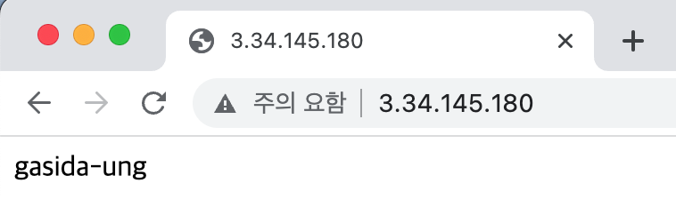

# Terraform: Study 1주차

## Repo 구조

```bash
# 1주차 도전과제 
├── 01 # EC2 웹 서버 배포
├── 02 # AWS S3/DynamoDB 백엔드
├── 03-1 #lifecycle의 precondition (non function)
├── 03-2 #lifecycle의 precondition (use function)
└── tfstate-backend # AWS 서비스 리소스 배포
```

1. EC2 웹 서버 배포 + 리소스 생성 그래프 확인
- terraform.tf
   -  Terraform backend와 provider 설정, 이번 code에는 없음
- network.tf
   -  EC2가 배포 될 VPC 및 Subnet 그리고 외부 통신을 위한 리소스들을 생성하기 위한 Terraform code
- ec2.tf
   -  EC2를 배포하는 Terraform code로 user_data에 templatefile을 이용하여 apache 설치 및 html 파일변경
- var.tf
   -  region 및 nickname등의 변수로 사용 할 값들을 미리 정리
- output.tf
   -  EC2의 Public IP
- template/install.tpl
   -  apache 설치 및 nickname이 있는 html파일을 만들기 위한 스크립트 파일
- base.dot
   -  terraform code의 도식화된 파일
- 실행
```bash
$ pwd
~/Terraform_study/terraform-study/00_0702/01
$ terraform apply -auto-approve
Apply complete! Resources: 10 added, 0 changed, 0 destroyed.

Outputs:

nomad_server_ip = "3.34.145.180"
```
- 결과화면

  


2. AWS S3 및 Backend 사용 (backend를 사용할 때의 S3와 RDS는 4번에서 설명)
- terraform.tf
   -  Terraform backend를 S3와 RDS를 이용하여 구성, S3와 RDS는 tfstate-backend 디렉토리에서 설명 
   -  Terraform block에서 다음과 같이 key를 설정하면 S3에 적용

  
- apply 이후 S3 적용 상태
          


3. 1.  lifecycle의 precondition(Function을 사용하지 않음)
- precondition.tf
   -  step0.txt ~ step6.txt 총 7개의 파일 이름 중 하나가 일치 시 검증 조건 만족으로 코드

3. 2.  lifecycle의 precondition(Function을 사용하지 않음)
- precondition.tf
   -  step0.txt ~ step6.txt 총 7개의 파일 이름 중 하나가 일치 시 검증 조건 만족으로 코드

4. AWS 서비스 리소스 배포 + 리소스 생성 그래프 확인
- backend.tf
   -  Terraform backend를 만들기 위한 S3와 RDS 생성 Terraform code
- var,tf
   -  S3 생성 시 prefix를 주기위한 변수 정의
- base.dot
   -  terraform code의 도식화된 파일